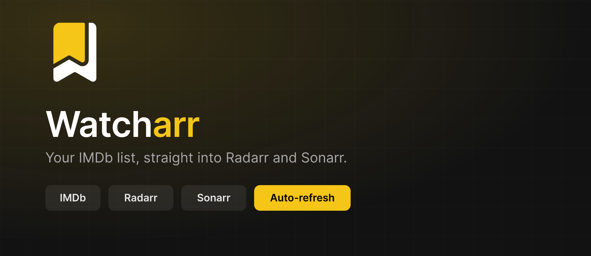
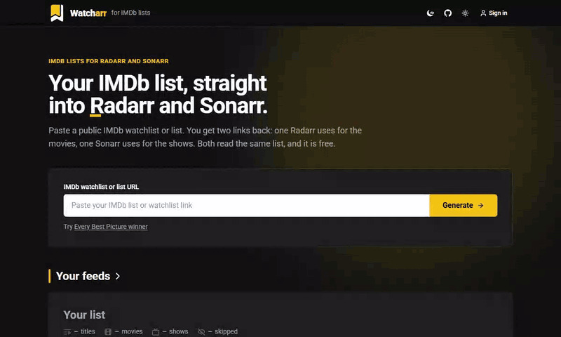
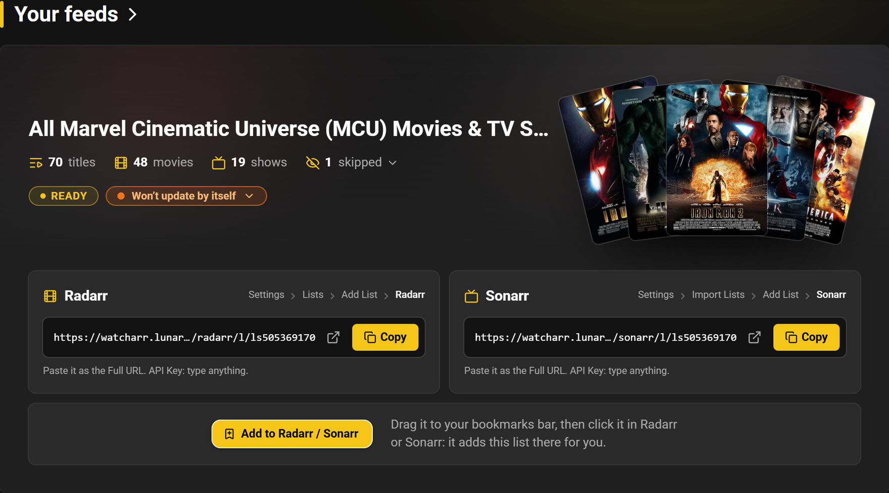
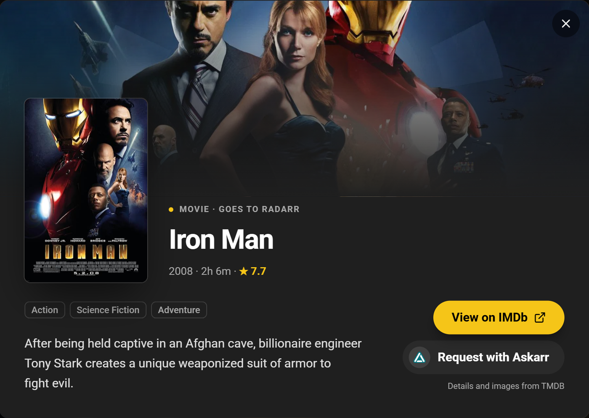
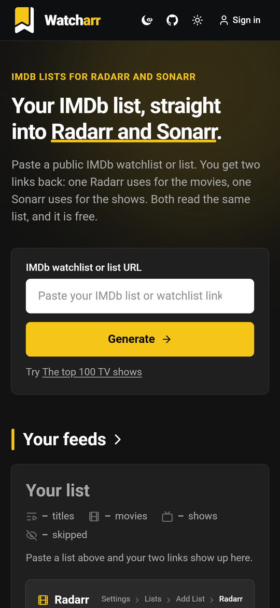
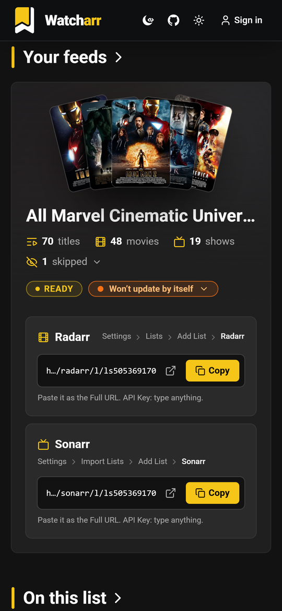
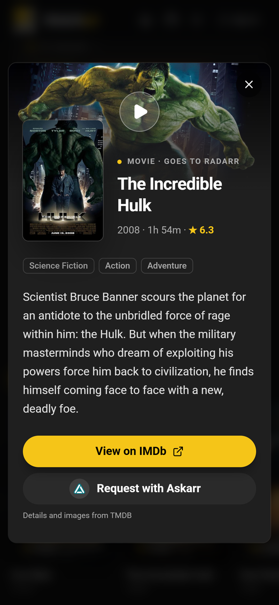

<div align="center">



### Your IMDb list, straight into Radarr and Sonarr.

Paste a public IMDb watchlist or list and get two links back: one Radarr checks every 15 minutes, one Sonarr checks every 5. Nothing to install, no account needed.

[](https://watcharr.lunarwerx.com)
[](https://github.com/LunarWerxs/Watcharr/actions/workflows/ci.yml)
[](#self-host-it)
[](#license)
[](https://discord.gg/PsWpeNUzhk)

[**▶ Open Watcharr**](https://watcharr.lunarwerx.com) · [Features](#features) · [Set it up](#set-it-up) · [How it works](#how-it-works) · [FAQ](#faq) · [Self-host](#self-host-it) · [Reference](docs/REFERENCE.md)

<br />



</div>

---

> ### IMDb Watcharr is now Watcharr
>
> Same tool, shorter name. Nothing you set up changes:
>
> - **Your Radarr and Sonarr lists keep working.** The links live on watcharr.lunarwerx.com, which
>   did not move.
> - **Old repo links redirect.** `LunarWerxs/IMDBWatcharr` points here now, so clones, remotes and
>   bookmarks keep working.

Sonarr dropped its built-in IMDb list import in 2025, and Radarr's stopped working when IMDb changed
its export format. Watcharr fills that gap. It reads a public IMDb watchlist or list through IMDb's
own API and serves it back as two links: the movies for Radarr, the shows for Sonarr. Each app adds
its link as a list of its own kind, the way it would read another Radarr or Sonarr, so a title you
add on IMDb shows up within minutes. No Trakt account in the middle, no script to keep running,
nothing to install.

## TL;DR

- 🎬 &nbsp;**One paste, two links.** Movies go to Radarr and shows go to Sonarr, from the same IMDb list.
- ⏱️ &nbsp;**Minutes, not hours.** Radarr checks its link every 15 minutes and Sonarr every 5, because each link answers as a Radarr or Sonarr server. An RSS List or Custom List would wait 12 and 6 hours.
- 🔖 &nbsp;**One-click setup.** Drag the **Add to Radarr / Sonarr** sticker to your bookmarks bar and click it inside Radarr or Sonarr. Your API key never leaves the app.
- 🔁 &nbsp;**Links that never change.** They are built from the IMDb list's own id, so the same list always gives the same two links.
- 🛟 &nbsp;**Never goes blank.** If a read of the list fails, both links keep serving the last good copy.
- 🎟️ &nbsp;**No account to start.** Sign in only if you want the list re-read on its own, about every 15 minutes.
- 🔓 &nbsp;**Source-available.** Free to use, and free to self-host for personal use.

> **[Open watcharr.lunarwerx.com →](https://watcharr.lunarwerx.com)** Paste a list, copy two links, done.

---

## Features

|  |  |
|---|---|
| 🎬 **Movies to Radarr, shows to Sonarr** | One IMDb list splits in two: movies and TV movies for Radarr, series and mini-series for Sonarr. The page counts each before you copy anything |
| ⏱️ **Radarr's and Sonarr's own list type** | Each link answers as a small Radarr or Sonarr v3 API, so the apps read it like another Radarr or Sonarr: every 15 and every 5 minutes. The same links still work as an RSS List and a Custom List |
| 🔖 **Add to Radarr / Sonarr in one click** | A bookmark that runs inside your own Radarr or Sonarr, with that page's API key. It asks for a Quality Profile and Root Folder, adds the list with Search on Add on, swaps out an older RSS or Custom List of the same link, and reads it at once. Click it again to remove the list |
| 🧭 **Watchlists and lists** | Any public watchlist or list, from the desktop site, the phone site (`m.imdb.com`) or IMDb's language paths (`imdb.com/de/list/…`) |
| 🔁 **Links that never change** | Built from the IMDb list's id, so you set them up once and pasting the list again gives the same two links |
| 📺 **Shows matched for Sonarr** | Sonarr adds shows by their TheTVDB id, which Watcharr finds through TVMaze and then TMDB. A show neither knows is left out rather than passed along broken, and the page lists which ones and why |
| 🍿 **Covers and details** | The list's covers in a row, each opening TMDB's plot, genres, rating, backdrop and trailer, a View on IMDb link, and a Request with [Askarr](https://askarr.com) step |
| 🔄 **Keeps itself current** | Sign in and the list is re-read about every 15 minutes. My feeds lists what you follow, and a bell tells you when a list has failed three reads in a row |
| 🛟 **Last good copy** | A failed read never empties your Radarr or Sonarr list: the links keep serving the last good snapshot, and the failure is recorded on the feed |
| 📱 **Works on a phone** | Paste, copy and browse from any screen. The one-click sticker shows on bigger screens, where there is a bookmarks bar |

<div align="center">
  
  <br /><sub>One list, two links, and the one-click sticker</sub>
  <br /><br />
  
  <br /><sub>Any cover opens the title, with details from TMDB</sub>
</div>

<br />

<table align="center">
  <tr>
    <td align="center"></td>
    <td align="center"></td>
    <td align="center"></td>
  </tr>
  <tr>
    <td align="center"><sub>Paste a link</sub></td>
    <td align="center"><sub>Copy your two links</sub></td>
    <td align="center"><sub>Browse what is on the list</sub></td>
  </tr>
</table>

---

## One link, a whole workaround gone

| Instead of... | You already have it |
|---|---|
| **Radarr's IMDb list import**, which broke when IMDb changed its export format | A link Radarr reads as its own list type, every 15 minutes |
| **Sonarr's IMDb list import**, removed in 2025 | A link Sonarr reads as its own list type, every 5 minutes |
| A **Trakt account** plus a **sync script** to keep running (Traktarr and friends) | Nothing to host and no second account: Watcharr reads IMDb's own API |
| An **RSS List** or **Custom List** the apps read every 12 or 6 hours | The same link, read every 15 or 5 minutes |
| **Copying titles by hand** every time the list changes | A link that follows the IMDb list as it changes |

Nothing gets copied into a second service you have to manage. Your list stays on IMDb; Radarr and
Sonarr pick it up from there.

---

## ⭐ Like it? Help it grow

Free, no ads, no paywall, built in the open. If Watcharr saves you a chore, a few seconds goes a long
way:

- ⭐ **[Star the repo](https://github.com/LunarWerxs/Watcharr)**: the clearest signal that this is worth maintaining.
- 💬 **[Join the Discord](https://discord.gg/PsWpeNUzhk)**: questions, ideas, and somewhere to shout when something breaks.
- 🐛 **[Open an issue](https://github.com/LunarWerxs/Watcharr/issues)**: a list that will not read, a show that should have matched, a step that confused you.

---

## Set it up

### 1. Make the links

Open **[watcharr.lunarwerx.com](https://watcharr.lunarwerx.com)**, paste a public IMDb watchlist or
list, and press **Generate**. Both links come back at once and fill in on the list's first read from
IMDb, usually within a few minutes. The page updates by itself when that lands.

A private list cannot be read. If yours is private, make it public on IMDb and paste it again.

### 2. Add them to Radarr and Sonarr

| App | Where | List type | Full URL | API Key |
|---|---|---|---|---|
| **Radarr** | Settings → Lists → Add List | **Radarr** | your Radarr link | type anything |
| **Sonarr** | Settings → Import Lists → Add List | **Sonarr** | your Sonarr link | type anything |

Pick your Quality Profile and Root Folder as usual, then save. Radarr checks the list every 15
minutes from then on, Sonarr every 5.

### Or: one click, from inside the app


On a computer, drag the **Add to Radarr / Sonarr** sticker under your links to the bookmarks bar.
Open Radarr or Sonarr, click the bookmark, and it adds the list there for you. It runs in that app's
own page with that page's API key, which never leaves the app.

### Which links work

The links are built from the IMDb id, so the same list always maps to the same two:

| Paste this | Radarr link | Sonarr link |
|---|---|---|
| `imdb.com/list/ls055592025/` | `/radarr/l/ls055592025` | `/sonarr/l/ls055592025` |
| `imdb.com/user/p.kdbeq6dtmzzpiin4k7t4fnunf4/watchlist/` | `/radarr/p/p.kdbeq6dtmzzpiin4k7t4fnunf4` | `/sonarr/p/p.kdbeq6dtmzzpiin4k7t4fnunf4` |

---

## How it works

```
                 paste a list                        every 15 / 5 minutes
   you  ─────────────────────▶   Watcharr   ◀─────────────────────────  Radarr / Sonarr
                          (Cloudflare Worker + D1)
                                     ▲
                                     │  snapshots
                         GitHub Actions runner  ─────▶  IMDb's GraphQL API
```

- **IMDb is read from GitHub, not from Cloudflare.** IMDb's API turns Cloudflare's shared Worker
  addresses away with `429` and answers a GitHub Actions runner fine. So a runner reads the lists (a
  pasted one within about five minutes, a followed one every 15) and posts each snapshot to the
  Worker, which stores it and serves it.
- **Each link is a tiny Radarr or Sonarr.** `{link}/api/v3/movie` answers as Radarr's movie list (by
  TMDB id) and `{link}/api/v3/series` as Sonarr's series list (by TVDB id), along with the pickers the
  list form asks for. Any API key is accepted, since the list is public anyway.
- **The ids come from TMDB and TVMaze.** IMDb does not carry Radarr's TMDB ids or Sonarr's TVDB ids,
  so the Worker looks each title up once and carries the answer across reads.
- **An unchanged list is not rebuilt.** Each snapshot is fingerprinted, so a read that finds nothing
  new writes nothing, and the RSS and custom-list answers come from a cached body with an `ETag`.

Every route, the sync job, the data model and the web app are written up in
**[docs/REFERENCE.md](docs/REFERENCE.md)**.

---

## Privacy

- **Making links needs nothing but a public IMDb URL.** No account, no email.
- **Signing in stores one opaque id**, used to remember which lists you follow. No name, no email, no
  profile.
- **The bookmark never sends your API key anywhere.** It runs inside your own Radarr or Sonarr and
  talks only to that app.
- **Analytics are LunarWerx's own:** a page-view pixel that honours Do Not Track and Global Privacy
  Control, and a once-a-session visit ping with a random visitor id. No IP address is stored.
  [Exactly what is sent](docs/REFERENCE.md#analytics).

---

## Self-host it

Watcharr is one Cloudflare Worker with a D1 database, plus a GitHub Actions job that reads IMDb. It
runs on Cloudflare's free tier, and GitHub Actions is free for a public repository.

```bash
git clone https://github.com/LunarWerxs/Watcharr.git
cd Watcharr
npm install
npx wrangler d1 create imdbwatcharr-db    # put its id in wrangler.toml
npm run db:migrate:remote
npx wrangler secret put INGEST_SECRET
npm run deploy
```

In [wrangler.toml](wrangler.toml), point `account_id`, the D1 `database_id`, the routes,
`PUBLIC_ORIGIN` and `GITHUB_REPOSITORY` at your own. Then, on your copy of the repo on GitHub, add
`INGEST_SECRET` as a repository secret and `WORKER_ORIGIN` (your Worker's address) as a repository
variable, so the sync job can post to it.

| Setting | What it is for |
|---|---|
| `INGEST_SECRET` (Worker secret and repo secret) | **Required.** The sync job's key for posting snapshots |
| `TMDB_TOKEN` (Worker secret) | **Recommended.** Movies in Radarr's own list type (their TMDB ids), a second source of TVDB ids, and the title popups. Without it, add the Radarr link as an RSS List instead |
| `GITHUB_DISPATCH_TOKEN` (Worker secret) | Optional. A pasted list is read within about a minute instead of on the next run. `npm run setup:dispatch` sets it without printing it |
| `CONNECTIONS_CLIENT_SECRET`, `SESSION_SECRET` (Worker secrets) | Optional. Sign-in and auto-refresh; without them the sign-in button hides and each list is read when it is pasted |

Local development, deployment and every route: [docs/REFERENCE.md](docs/REFERENCE.md).

---

## Known limits

- **A brand-new list takes a few minutes.** It is read on the next sync run (about five minutes, or
  about one with a dispatch token); until then its links answer `503` with a `Retry-After`, and the
  page fills in by itself when it lands.
- **Private lists cannot be read.** IMDb answers them with a permission error, and the page says so.
- **Some shows cannot reach Sonarr.** Sonarr only adds shows listed on TheTVDB. The ones that are
  not are usually shows that were announced and never made; they join the link if they are ever
  listed.
- **A movie reaches Radarr's own list type once TMDB knows it.** The rare one TMDB does not know
  stays in the RSS answer only.
- **Scheduled runs drift.** GitHub delays scheduled jobs under load, so 5 and 15 minutes are floors,
  not a clock.
- **Personal use only.** IMDb's API forbids public and commercial use of its data, so Watcharr feeds
  one household's Radarr and Sonarr, not a public index or a business.

---

## How it compares

- **Trakt bridges** (Radarr's Trakt lists, Traktarr and similar) route an IMDb list through a
  separate Trakt account, and often a script you host, before Radarr or Sonarr ever see it. Watcharr
  reads IMDb directly: no Trakt account, nothing to host.
- **[MDBList](https://mdblist.com)** is a general list aggregator that can also take an IMDb list and
  hand it to Radarr or Sonarr, alongside Trakt, Rotten Tomatoes and other sources. Watcharr does one
  thing: your IMDb list, as Radarr's and Sonarr's own list type, with no account needed.
- **Copying titles by hand** works once. Watcharr's links follow the list as it changes.

---

## FAQ

**Is Watcharr free?**
Yes. Making links, using them and signing in are all free, with no paid tier and no payment set up
anywhere. The code is source-available too, so you can run your own copy for personal use.

**Do I need an account?**
No. Both links come back at once and serve the list from its first read, usually within a few
minutes. Signing in only adds one thing: the list is re-read about every 15 minutes instead of
staying on that first read.

**Which list type do I pick in Radarr and Sonarr?**
**Radarr** in Radarr and **Sonarr** in Sonarr: paste the link as the Full URL and type anything as
the API Key. The same links also work as a Radarr RSS List and a Sonarr Custom List, but the apps
read those only every 12 and 6 hours.

**Does the bookmark see my Radarr or Sonarr API key?**
It uses it, inside the app's own page, to add the list for you, and it never sends it anywhere else.
The bookmark talks only to the Radarr or Sonarr you clicked it in.

**Why is a show missing from my Sonarr list?**
Sonarr needs a TheTVDB id for every show, and not every IMDb title has one. A show Watcharr cannot
match is left out rather than passed along broken, and the page tells you which ones were skipped.

**Why does a list I just pasted not show anything yet?**
A brand-new list is read on the next sync run, usually within a few minutes; until then its links
answer `503`, which Radarr and Sonarr treat as "try again later". If it never fills in, the list is
probably private on IMDb: make it public and paste it again.

**Does it work offline?**
No. It is a hosted service: watcharr.lunarwerx.com reads IMDb and serves the links, and Radarr and
Sonarr reach it over the network. For a private setup, [self-host it](#self-host-it).

---

## Also from LunarWerx

**Want a single title rather than a whole list?** [Askarr](https://askarr.com) lets you search any
movie or show from any browser and request it; the Askarr Monitor on your Windows PC adds it to your
own Radarr and Sonarr, so neither has to face the internet.

Also by [LunarWerx](https://lunarwerx.com): [RepoYeti](https://repoyeti.com),
[AgentHydra](https://agenthydra.lunarwerx.com), [SageThumbs 2K](https://sagethumbs.lunarwerx.com) and
[DevWebUI](https://devwebui.lunarwerx.com).

## License

[PolyForm Noncommercial 1.0.0](LICENSE), copyright LunarWerx Studios, from 2026-09-27 on. The site is
free, and so is running your own copy for yourself, your household or any other noncommercial
purpose. Commercial use (selling it, charging for access, bundling it into a paid service, running it
for a business) is not licensed, and there is no commercial license for sale: IMDb's API says
commercial use of its data is not allowed. [LICENSING.md](LICENSING.md) has the details; versions up
to commit `25bc710` stay under [MIT](LICENSES/MIT-legacy.txt).

## Credits

Not affiliated with IMDb; IMDb is a trademark of IMDb.com, Inc. Title details and images come from
[TMDB](https://www.themoviedb.org): this product uses the TMDB API but is not endorsed or certified by
TMDB. Show ids come from [TVMaze](https://www.tvmaze.com) and TMDB.
